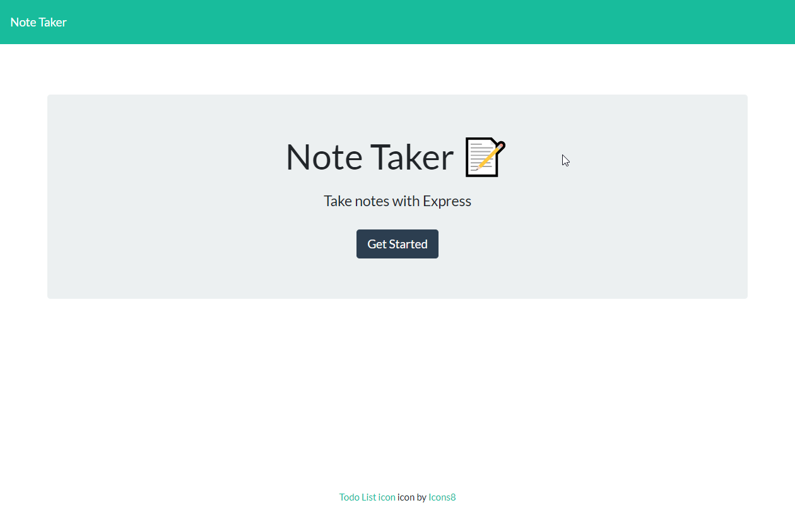
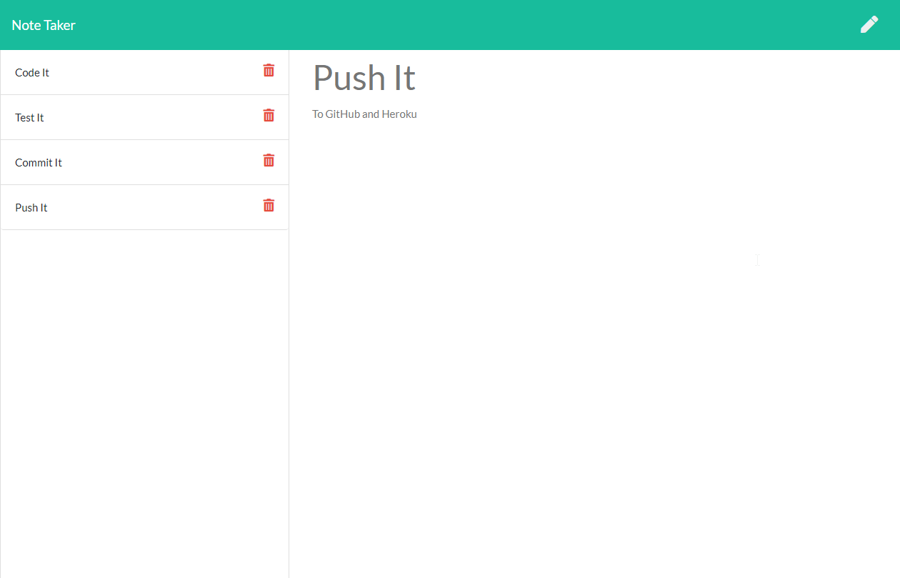
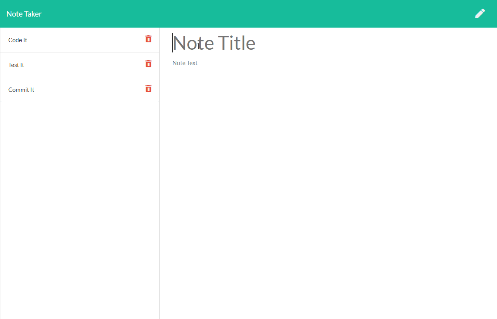

# Express Note Taker
 &emsp;&emsp;

&nbsp;
## **Table of Contents**
  - [**Description**](#description)
  - [**Live Application**](#live-application)
  - [**Application Screenshots and Demo**](#application-screenshots-and-demo)
  - [**Technologies and Services**](#technologies-and-services)
  - [**License**](#license)

&nbsp;
## **Description**
Express Note Taker is a simple note taking web application where a user can write and save notes for review later.  

Express Note Taker is a full stack web application with an front end built using HTML, CSS, and JavaScript and a back end run using express.js. The front end is responsible for displaying a GUI to the user with an area for writing notes and a list of saved notes. Client side interactions to save a note, retrieve a saved note for viewing its contents, or deleting a note make post, get, and delete route calls to the server to interact with data storage. The back end is responsible for serving up the landing and notes page to the user upon navigation to the app in a browser and processing api routes to create (save), read, and delete notes. Notes storage is currently implemented as a local JSON object on the server and is initially set as an empty list. Saved notes are added to the list and can be retrieved during a single session with the server. Future replacement of the JSON storage object with a database will provided persistent storage between server connections. 

The web application is hosted on Heroku for demonstration. 

&nbsp;
## **[Live Application](https://spf-exjs-notetaker.herokuapp.com/)**
## **Application Screenshots and Demo**

&nbsp;
## **Technologies and Services**
Development Technologies
- HTML, CSS, JavaScript, Node.js, Express.js

External Package, Frameworks, and Services
- Node.js packages: express, uuid
- [Bootstrap](https://getbootstrap.com/)

&nbsp;
## **License**
Licensed under the [MIT](./LICENSE) license.
